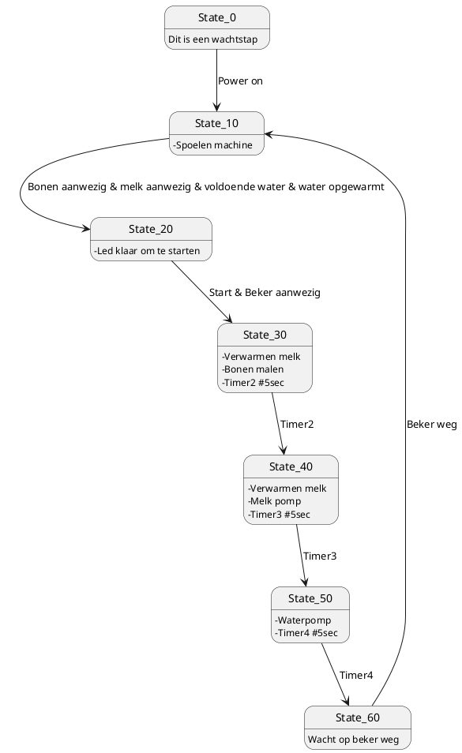
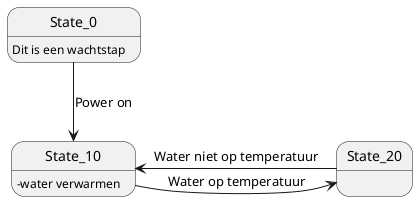

# State diagram
De state diagam voor de verschillende taken. Als eerst word de 1 weergegeven en als tweede proces 2.

Proces 1:

```plantuml
@startuml
State_0 : Dit is een wachtstap
State_10 :-Spoelen machine
State_20 : -Led klaar om te starten
State_30 : -Verwarmen melk
State_30 : -Bonen malen
State_30 : -Timer2 #5sec
State_40 : -Verwarmen melk
State_40 : -Melk pomp
State_40 : -Timer3 #5sec
State_50 : -Waterpomp
State_50 : -Timer4 #5sec
State_60 : Wacht op beker weg

State_0 --> State_10 : Power on
State_10 --> State_20 : Bonen aanwezig & melk aanwezig & voldoende water & water opgewarmt
State_20 --> State_30 : Start & Beker aanwezig
State_30 --> State_40 : Timer2
State_40 --> State_50 : Timer3
State_50 --> State_60 : Timer4
State_60 --> State_10 : Beker weg
@enduml
```

Proces 2:

```plantuml
@startuml
State_0 : Dit is een wachtstap
State_10 :-water verwarmen
State_20 : 


State_0 --> State_10 : Power on
State_10 -> State_20 : Water op temperatuur
State_20 -> State_10 : Water niet op temperatuur
@enduml
```